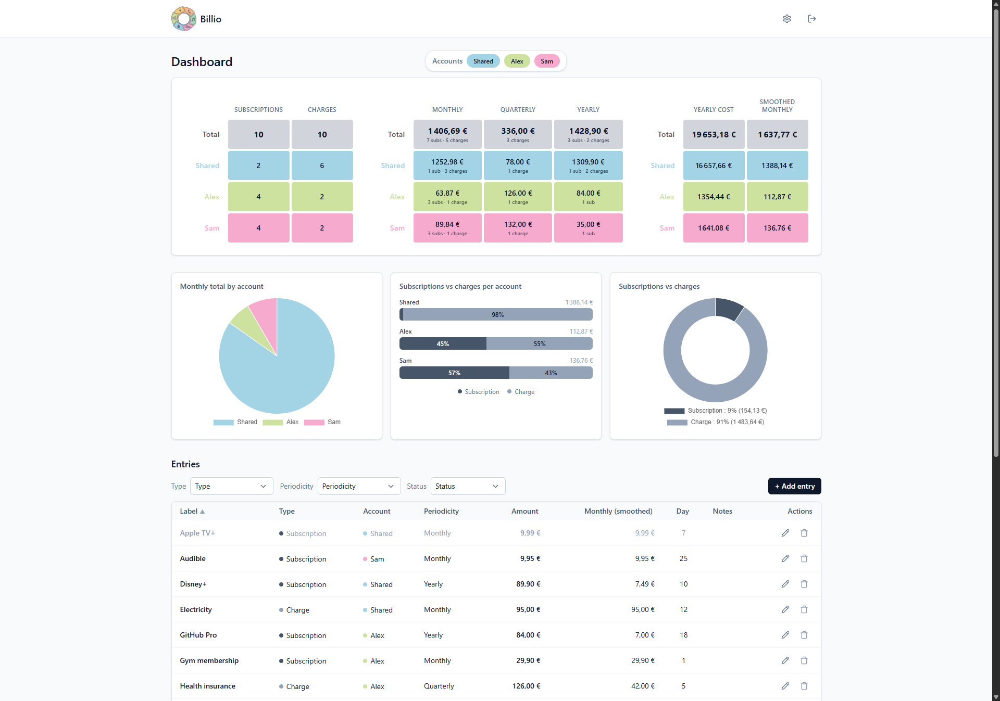

# Billio

**Billio** is a small self-hosted app for tracking your recurring household charges and subscriptions (rent, electricity, insurance, internet box, VOD, music, and so on).

The idea: a single page that answers the question *"how much do I really pay every month?"*, with quarterly and yearly charges automatically smoothed back to a monthly figure.



## What it's for

- Keep all your recurring payments in one place.
- See your **smoothed monthly cost** at a glance (quarterly and yearly charges are spread evenly across months) along with the **total yearly cost**.
- Split expenses across several *accounts* (for example "Shared", "Me", "Partner") and compare totals.
- Pause a subscription temporarily without deleting it (handy for free trials or holidays).
- Share the same data with the rest of the household: each person logs in with their own credentials.

## Features

- **Dashboard** with a per-account summary: number of subscriptions, number of charges, monthly, quarterly, yearly and smoothed totals.
- **Charts**: monthly breakdown by account (pie), subscriptions vs charges by account (bars), overall subscription/charge share (donut).
- **Filterable list** of entries: by account, by type (subscription / charge), by periodicity (monthly / quarterly / yearly), by status (active / inactive).
- **Customisable accounts**: name, colour, display order.
- **Multi-user with roles**: admins manage accounts and users; regular users can view the dashboard and edit entries.
- **Bilingual interface**: English and French, switchable any time from the settings.
- **Multi-currency**: pick from EUR, USD, GBP, CHF, CAD, AUD or JPY; each amount renders in its native format (e.g. `1 234,56 €` for euros, `$1,234.56` for US dollars).
- **Responsive**: comfortable to use on a phone.
- **Secure sign-in**: bcrypt password hashes, signed session cookies, forced password change on first login.

## Getting started

Billio is self-hosted: you install it on your own machine or a small server, and access it from your browser. Two ways to run it.

### With Docker (recommended)

Requirements: **Docker** and **Docker Compose**.

```sh
docker compose up -d --build
```

The app is then reachable at `http://localhost:3000`. The SQLite database is stored on the host in `./data/local.db` thanks to a bind mount, so it survives container rebuilds and updates. Back it up by copying that folder.

To pull a new version of the code and rebuild:

```sh
git pull
docker compose up -d --build
```

To stop the app:

```sh
docker compose down
```

### Run from a published image (Unraid, NAS, remote server)

Each push to `main` of this repository builds and publishes a multi-arch image (`linux/amd64` and `linux/arm64`) to **GitHub Container Registry** at `ghcr.io/bsdev90/billio`. You don't need to clone the source to deploy: paste the snippet below in your host's Compose UI (Unraid Compose Manager, Portainer stack, Dockge, plain `docker-compose.yml` on a server, etc.).

```yaml
services:
  billio:
    image: ghcr.io/bsdev90/billio:latest
    container_name: billio
    restart: unless-stopped
    ports:
      - "3000:3000"
    volumes:
      # Adjust the host path to wherever you keep app data.
      # On Unraid the convention is /mnt/user/appdata/billio
      - ./data:/data
    environment:
      # Optional. Leave unset to auto-generate one and store it in the DB.
      # APP_SESSION_SECRET: change-me
```

Then `docker compose up -d` (or hit *Apply* in the Unraid UI). The app listens on port `3000`; map it to whatever port you want on the host side. The database file appears at `<host data path>/local.db` and is the only thing you need to back up.

Image tags available on GHCR:

- `latest`: the tip of `main`
- `v1.2.3`, `1.2`, `1`: published when a Git tag like `v1.2.3` is pushed

> **First push only**: by default the GHCR package created by the GitHub Action is private. To let others (or your Unraid box without auth) pull it, go to GitHub → your profile → *Packages* → *billio* → *Package settings* → *Change visibility* → *Public*.

### Without Docker

Requirements: **Node.js 20 or newer**.

```sh
cp .env.example .env
# Set APP_SESSION_SECRET in .env (optional; one is auto-generated and stored in the DB if absent)
# You can generate one with: openssl rand -hex 32

npm install
npm run build
npm run preview
```

The app is then reachable at `http://localhost:4173` (or the port shown in the console).

For long-term use, run the compiled build behind a reverse proxy (nginx, Caddy, Traefik, etc.) with HTTPS in front.

### First sign-in

On first launch Billio creates an initial **admin** account with the credentials:

- **Login**: `admin`
- **Password**: `admin`

You'll be **forced to change them** on first sign-in. Pick a password of at least 8 characters. From there on, all user and credential management happens in the app.

## Using Billio

1. **Create your accounts** in *Settings → Accounts* (admins only). An account groups related expenses (per household, per person, per project, and so on). Each account has a colour that's reused in the charts.
2. **Invite the rest of the household** in *Settings → Users* (admins only). For each person you can choose whether they're a regular user or an admin. New users are asked to set their password on first sign-in.
3. **Add your entries** from the dashboard. For each one, fill in:
   - a **label** (for example *Netflix*, *Rent*, *Car insurance*),
   - the **type**: *subscription* or *charge*,
   - the **periodicity**: monthly, quarterly or yearly,
   - the **amount**,
   - the **account** the entry belongs to,
   - optionally the day of the month and a note.
4. **Read the dashboard**. The smoothed monthly total is computed automatically (a yearly charge of €120 shows up as €10/month smoothed).
5. **Deactivate** an entry instead of deleting it when the expense is just paused: it drops out of the totals but stays visible under the *Inactive* filter.

Accounts and entries are shared across all users of the same instance, so everyone sees the same household budget.

## Storage and backup

All your data lives in a single SQLite file (`local.db` at the project root by default). To back it up, just copy that file, either while the app is stopped or with a hot SQLite copy command.

No data is ever sent anywhere; no third-party service is contacted.

## Configuration (optional)

A few environment variables let you tweak the behaviour, but the defaults are fine for most setups:

| Variable | Default | Purpose |
|---|---|---|
| `DATABASE_URL` | `local.db` | Path to the SQLite file |
| `APP_SESSION_SECRET` | generated on first run | Secret used to sign session cookies |
| `APP_SESSION_TTL` | `2592000` (30 days) | Session lifetime, in seconds |
| `PORT` | `3000` | Port the server listens on |

## License

Billio is released under the **Creative Commons Attribution-NonCommercial 4.0 International** license ([CC BY-NC 4.0](https://creativecommons.org/licenses/by-nc/4.0/)).

You are free to:

- **Share**: copy and redistribute the code in any medium or format.
- **Adapt**: remix, transform and build upon the code.

Under the following terms:

- **Attribution**: you must give appropriate credit and indicate if changes were made.
- **NonCommercial**: you may not use the code for commercial purposes.
